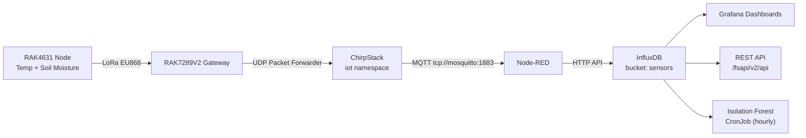

# LoRaWAN Architecture

## Introduction to LoRaWAN

**LoRaWAN** (*Long Range Wide Area Network*) is a MAC layer network protocol designed for long-range, low-power IoT communications. Unlike mesh topologies, LoRaWAN uses a **star topology**: sensor nodes transmit directly to a central gateway, which forwards data to a network server.

### Why LoRaWAN for forest fire prevention?

| Advantage | Detail |
|-----------|--------|
| **Standardised** | Open protocol, compatible with thousands of devices |
| **Network server** | ChirpStack manages ADR, deduplication, sessions |
| **Decoders** | Payload decoded server-side, not on device |
| **Scalability** | One gateway can cover hundreds of nodes |
| **Low power** | Nodes run on battery for months |
| **Range** | Up to 10–15 km in open terrain |

---

## Architecture Overview



---

## 1. Gateway — RAK7289V2

| Parameter | Value |
|-----------|-------|
| **Model** | RAK WisGate Edge Pro (RAK7289V2) |
| **Protocol** | Semtech UDP Packet Forwarder |
| **Band** | EU868 (863–870 MHz) |
| **Channels** | 8 channels |
| **Backhaul** | Ethernet / WiFi |
| **Server address** | ChirpStack service (`chirpstack.iot.svc.cluster.local`) |
| **UDP port (up)** | 1700 |
| **UDP port (down)** | 1700 |

### Packet Forwarder Configuration

```json
{
    "server_address": "chirpstack.iot.svc.cluster.local",
    "serv_port_up": 1700,
    "serv_port_down": 1700,
    "keepalive_interval": 10,
    "stat_interval": 30,
    "push_timeout_ms": 100,
    "forward_crc_valid": true,
    "forward_crc_error": false,
    "forward_crc_disabled": false
}
```

### Deployment

The gateway is deployed at the ITB laboratory, with the antenna oriented towards the Collserola Natural Park. Estimated coverage radius: 5–10 km in open terrain.

---

## 2. Sensor Nodes — RAK4631

### Hardware

| Component | Model | Function |
|-----------|-------|----------|
| **Core module** | RAK4631 (nRF52840 + SX1262) | MCU + LoRa radio |
| **Base board** | RAK19007 WisBlock Base | Power + connectors |
| **Temp/Humidity sensor** | RAK1901 (SHTC3) | Air temperature and humidity |
| **Soil moisture sensor** | RAK12023 + RAK12035 | Soil moisture measurement |
| **Power** | LiPo battery 3.7V | Up to 6 months autonomy |

### LoRaWAN Configuration

| Parameter | Value |
|-----------|-------|
| **Activation** | OTAA (Over-The-Air Activation) |
| **DevEUI** | Unique per device (printed on module) |
| **AppEUI / JoinEUI** | Configured in ChirpStack application |
| **AppKey** | `XXXXXXXXXXXXXXXXXXXXXXXXXXXXXXXX` (stored securely) |
| **Spreading Factor** | SF7 (adaptive via ADR) |
| **Bandwidth** | 125 kHz |
| **TX Power** | 14 dBm |
| **Coding Rate** | 4/5 |
| **Frequency plan** | EU868 |

### Transmission Interval

Configurable by the client. Default: **60 minutes** per uplink.

Each uplink cycle:
1. Wake up from deep sleep
2. Read RAK1901 (temperature + humidity)
3. Read RAK12023/RAK12035 (soil moisture)
4. Build payload (CayenneLPP format)
5. Transmit via LoRa
6. Return to deep sleep

---

## 3. Payload Format — CayenneLPP

```javascript
// ChirpStack codec — JavaScript decoder
function decodeUplink(input) {
    var bytes = input.bytes;
    var decoded = {};

    // Temperature (RAK1901) — bytes 0-1, signed int16, /100
    decoded.temperature = ((bytes[0] << 8) | bytes[1]) / 100.0;

    // Humidity (RAK1901) — bytes 2-3, uint16, /100
    decoded.humidity = ((bytes[2] << 8) | bytes[3]) / 100.0;

    // Soil moisture (RAK12023) — bytes 4-5, uint16, /10
    decoded.soil_moisture = ((bytes[4] << 8) | bytes[5]) / 10.0;

    // Battery voltage — bytes 6-7, uint16, /1000
    decoded.battery_mv = ((bytes[6] << 8) | bytes[7]);

    return { data: decoded };
}
```

---

## 4. ChirpStack — Network Server

ChirpStack is deployed in the `iot` namespace in Kubernetes.

| Parameter | Value |
|-----------|-------|
| **URL** | `/chirpstack` |
| **Version** | ChirpStack v4 |
| **Database** | PostgreSQL (`chirpstack` db) |
| **MQTT broker** | `mosquitto:1883` |
| **MQTT topic** | `application/+/device/+/event/up` |

### Data flow: ChirpStack → InfluxDB

RAK4631 → [LoRa] → RAK7289V2 → [UDP] → ChirpStack  
→ [MQTT] → mosquitto:1883  
→ [Subscribe] → Node-RED  
→ [Parse + Write] → InfluxDB (bucket: sensors, org: firesense)

Node-RED subscribes to `application/+/device/+/event/up` and writes to InfluxDB with measurement `sensor_data`, fields: `temperature`, `soil_moisture`, `humidity`, `battery_mv`.

---

## 5. Node-RED Flow

The Node-RED flow in the `iot` namespace processes incoming MQTT messages:

1. **MQTT In** — subscribes to ChirpStack topic
2. **JSON Parse** — decodes the uplink payload
3. **Function** — extracts fields and adds tags (dev_eui, application_id)
4. **InfluxDB Out** — writes to bucket `sensors`, org `firesense`

---

## 6. REST API

The FireSense REST API (`api-rest` deployment, namespace `firesense`) exposes sensor data:

| Endpoint | Method | Description |
|----------|--------|-------------|
| `/fsapi/v2/api/health` | GET | Service health check |
| `/fsapi/v2/api/sensors` | GET | Sensor readings (param: `hours`, `limit`) |
| `/fsapi/v2/api/sensors/latest` | GET | Latest reading per device |
| `/fsapi/v2/api/anomalies` | GET | Isolation Forest anomaly results |
| `/fsapi/v2/api/risk` | GET | Current fire risk level |

---

## 7. AI Anomaly Detection — Isolation Forest

A Kubernetes CronJob runs every hour in the `iot` namespace:

- **Image**: `isolation-forest:v1`
- **Algorithm**: scikit-learn Isolation Forest (`contamination=0.05`)
- **Input**: Last 24h of `sensor_data` from InfluxDB
- **Output**: Writes `anomalies` measurement to InfluxDB
- **Fields**: `anomaly_score`, `is_anomaly`, `temperature`, `soil_moisture`

---

## 8. Troubleshooting

### Node not joining

```bash
# Check ChirpStack logs
kubectl logs -n iot deployment/chirpstack -f

# Verify gateway is connected in ChirpStack UI
# Check DevEUI and AppKey match ChirpStack configuration
```

### No data in InfluxDB

```bash
# Check Node-RED logs
kubectl logs -n iot statefulset/nodered -f

# Check MQTT messages arriving
kubectl exec -n iot deployment/mosquitto -- \
  mosquitto_sub -t "application/#" -v
```

### Gateway offline

```bash
# Check UDP connectivity from gateway to ChirpStack
# Verify server_address in packet forwarder config
# Check ChirpStack gateway list in UI
```
