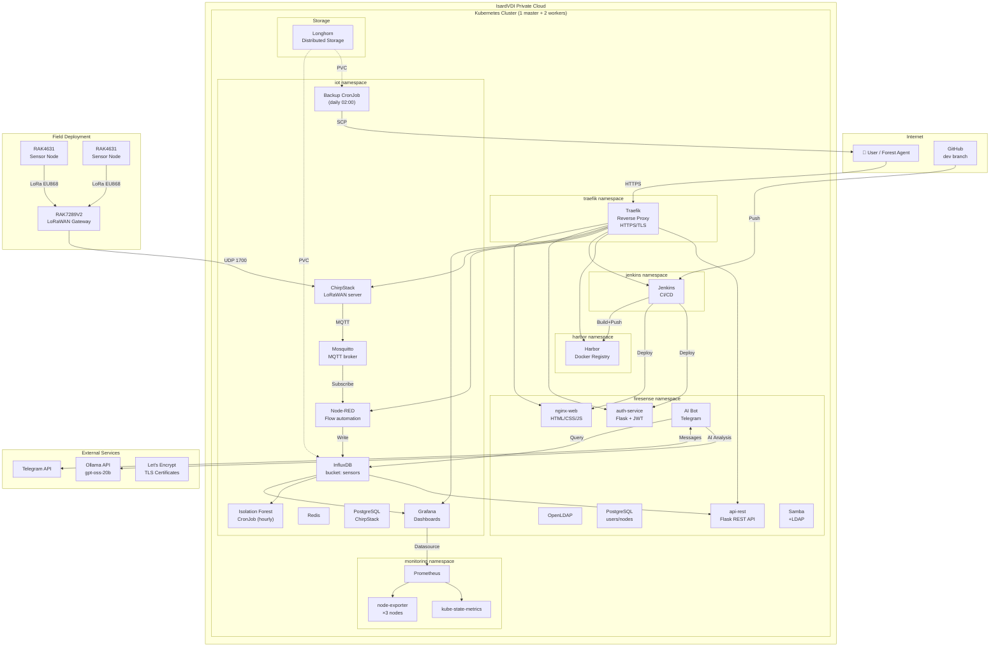
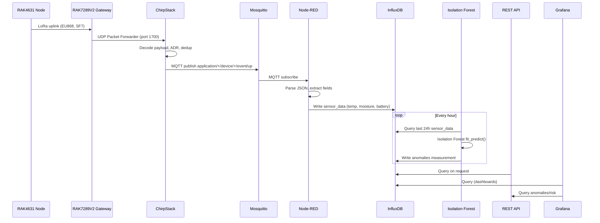
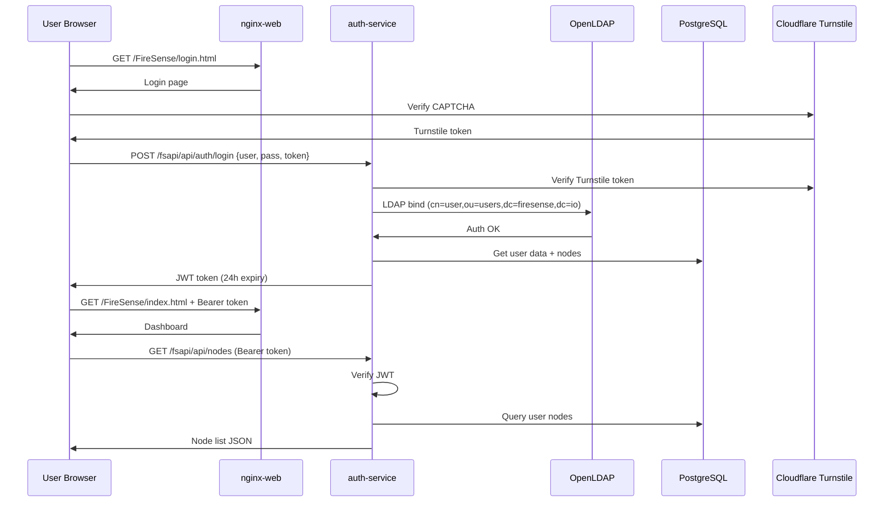
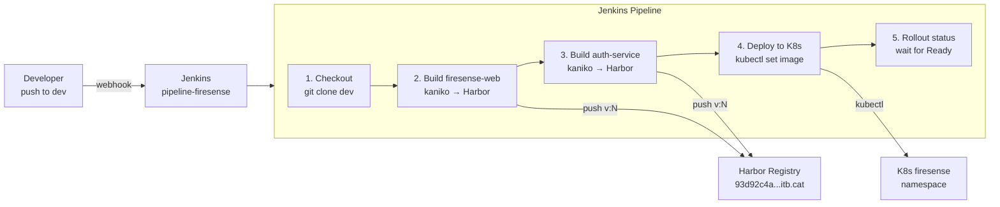
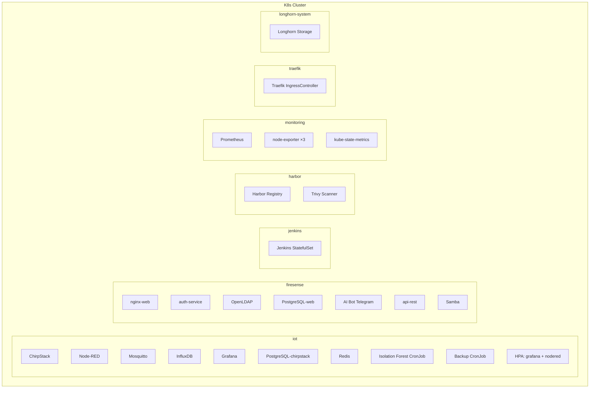

# FireSense — Architecture Diagrams

## 1. Global Architecture

```mermaid
graph TB
    subgraph Internet
        USER["👤 User / Forest Agent"]
        GITHUB["GitHub\ndev branch"]
    end

    subgraph IsardVDI["IsardVDI Private Cloud"]
        subgraph K8s["Kubernetes Cluster (1 master + 2 workers)"]
            subgraph traefik_ns["traefik namespace"]
                TRAEFIK["Traefik\nReverse Proxy\nHTTPS/TLS"]
            end

            subgraph firesense_ns["firesense namespace"]
                NGINX["nginx-web\nHTML/CSS/JS"]
                AUTH["auth-service\nFlask + JWT"]
                LDAP["OpenLDAP"]
                PGWEB["PostgreSQL\nusers/nodes"]
                AIBOT["AI Bot\nTelegram"]
                APIREST["api-rest\nFlask REST API"]
                SAMBA["Samba\n+LDAP"]
            end

            subgraph iot_ns["iot namespace"]
                CHIRP["ChirpStack\nLoRaWAN server"]
                NODERED["Node-RED\nFlow automation"]
                MOSQUITTO["Mosquitto\nMQTT broker"]
                INFLUX["InfluxDB\nbucket: sensors"]
                GRAFANA["Grafana\nDashboards"]
                REDIS["Redis"]
                PGIOT["PostgreSQL\nChirpStack"]
                IFOREST["Isolation Forest\nCronJob (hourly)"]
                BACKUP["Backup CronJob\n(daily 02:00)"]
            end

            subgraph jenkins_ns["jenkins namespace"]
                JENKINS["Jenkins\nCI/CD"]
            end

            subgraph monitoring_ns["monitoring namespace"]
                PROM["Prometheus"]
                NODE_EXP["node-exporter\n×3 nodes"]
                KSM["kube-state-metrics"]
            end

            subgraph harbor_ns["harbor namespace"]
                HARBOR["Harbor\nDocker Registry"]
            end

            subgraph storage["Storage"]
                LONGHORN["Longhorn\nDistributed Storage"]
            end
        end
    end

    subgraph Field["Field Deployment"]
        GW["RAK7289V2\nLoRaWAN Gateway"]
        NODE1["RAK4631\nSensor Node"]
        NODE2["RAK4631\nSensor Node"]
    end

    subgraph External["External Services"]
        OLLAMA["Ollama API\ngpt-oss-20b"]
        TELEGRAM["Telegram API"]
        LETSENCRYPT["Let's Encrypt\nTLS Certificates"]
    end

    USER -->|HTTPS| TRAEFIK
    TRAEFIK --> NGINX
    TRAEFIK --> AUTH
    TRAEFIK --> GRAFANA
    TRAEFIK --> CHIRP
    TRAEFIK --> NODERED
    TRAEFIK --> JENKINS
    TRAEFIK --> HARBOR
    TRAEFIK --> APIREST

    NODE1 -->|LoRa EU868| GW
    NODE2 -->|LoRa EU868| GW
    GW -->|UDP 1700| CHIRP
    CHIRP -->|MQTT| MOSQUITTO
    MOSQUITTO -->|Subscribe| NODERED
    NODERED -->|Write| INFLUX
    INFLUX --> GRAFANA
    INFLUX --> IFOREST
    INFLUX --> APIREST
    AIBOT -->|Query| INFLUX
    AIBOT <-->|Messages| TELEGRAM
    AIBOT -->|AI Analysis| OLLAMA

    GITHUB -->|Push| JENKINS
    JENKINS -->|Build+Push| HARBOR
    JENKINS -->|Deploy| NGINX
    JENKINS -->|Deploy| AUTH

    PROM --> NODE_EXP
    PROM --> KSM
    GRAFANA -->|Datasource| PROM

    BACKUP -->|SCP| USER
    LONGHORN -.->|PVC| INFLUX
    LONGHORN -.->|PVC| BACKUP
```

---

## 2. IoT Data Pipeline

```mermaid
sequenceDiagram
    participant N as RAK4631 Node
    participant G as RAK7289V2 Gateway
    participant C as ChirpStack
    participant M as Mosquitto
    participant NR as Node-RED
    participant I as InfluxDB
    participant IF as Isolation Forest
    participant API as REST API
    participant GR as Grafana

    N->>G: LoRa uplink (EU868, SF7)
    G->>C: UDP Packet Forwarder (port 1700)
    C->>C: Decode payload, ADR, dedup
    C->>M: MQTT publish application/+/device/+/event/up
    M->>NR: MQTT subscribe
    NR->>NR: Parse JSON, extract fields
    NR->>I: Write sensor_data (temp, moisture, battery)
    
    loop Every hour
        IF->>I: Query last 24h sensor_data
        IF->>IF: Isolation Forest fit_predict()
        IF->>I: Write anomalies measurement
    end

    API->>I: Query on request
    GR->>I: Query (dashboards)
    GR->>API: Query anomalies/risk
```

---

## 3. Authentication Flow

```mermaid
sequenceDiagram
    participant U as User Browser
    participant N as nginx-web
    participant A as auth-service
    participant L as OpenLDAP
    participant P as PostgreSQL
    participant CF as Cloudflare Turnstile

    U->>N: GET /FireSense/login.html
    N->>U: Login page
    U->>CF: Verify CAPTCHA
    CF->>U: Turnstile token
    U->>A: POST /fsapi/api/auth/login {user, pass, token}
    A->>CF: Verify Turnstile token
    A->>L: LDAP bind (cn=user,ou=users,dc=firesense,dc=io)
    L->>A: Auth OK
    A->>P: Get user data + nodes
    A->>U: JWT token (24h expiry)
    U->>N: GET /FireSense/index.html + Bearer token
    N->>U: Dashboard
    U->>A: GET /fsapi/api/nodes (Bearer token)
    A->>A: Verify JWT
    A->>P: Query user nodes
    A->>U: Node list JSON
```

---

## 4. CI/CD Pipeline

```mermaid
graph LR
    DEV["Developer\npush to dev"] -->|webhook| JENKINS["Jenkins\npipeline-firesense"]
    
    subgraph Pipeline["Jenkins Pipeline"]
        S1["1. Checkout\ngit clone dev"] --> S2["2. Build firesense-web\nkaniko → Harbor"]
        S2 --> S3["3. Build auth-service\nkaniko → Harbor"]
        S3 --> S4["4. Deploy to K8s\nkubectl set image"]
        S4 --> S5["5. Rollout status\nwait for Ready"]
    end
    
    JENKINS --> Pipeline
    S2 -->|push v:N| HARBOR["Harbor Registry\n93d92c4a...itb.cat"]
    S3 -->|push v:N| HARBOR
    S4 -->|kubectl| K8S["K8s firesense\nnamespace"]
```

---

## 5. Kubernetes Namespaces

```mermaid
graph TB
    subgraph Cluster["K8s Cluster"]
        subgraph NS1["iot"]
            A1["ChirpStack"] 
            A2["Node-RED"]
            A3["Mosquitto"]
            A4["InfluxDB"]
            A5["Grafana"]
            A6["PostgreSQL-chirpstack"]
            A7["Redis"]
            A8["Isolation Forest CronJob"]
            A9["Backup CronJob"]
            A10["HPA: grafana + nodered"]
        end
        subgraph NS2["firesense"]
            B1["nginx-web"]
            B2["auth-service"]
            B3["OpenLDAP"]
            B4["PostgreSQL-web"]
            B5["AI Bot Telegram"]
            B6["api-rest"]
            B7["Samba"]
        end
        subgraph NS3["jenkins"]
            C1["Jenkins StatefulSet"]
        end
        subgraph NS4["harbor"]
            D1["Harbor Registry"]
            D2["Trivy Scanner"]
        end
        subgraph NS5["monitoring"]
            E1["Prometheus"]
            E2["node-exporter ×3"]
            E3["kube-state-metrics"]
        end
        subgraph NS6["traefik"]
            F1["Traefik IngressController"]
        end
        subgraph NS7["longhorn-system"]
            G1["Longhorn Storage"]
        end
    end
```
