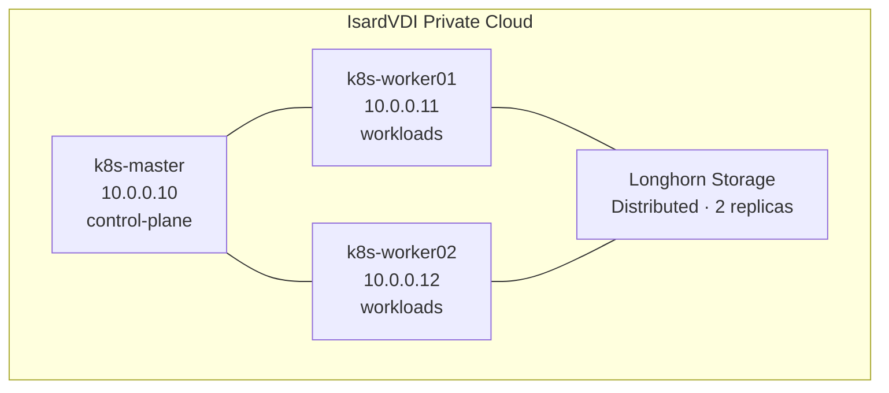
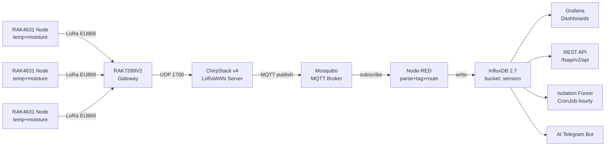
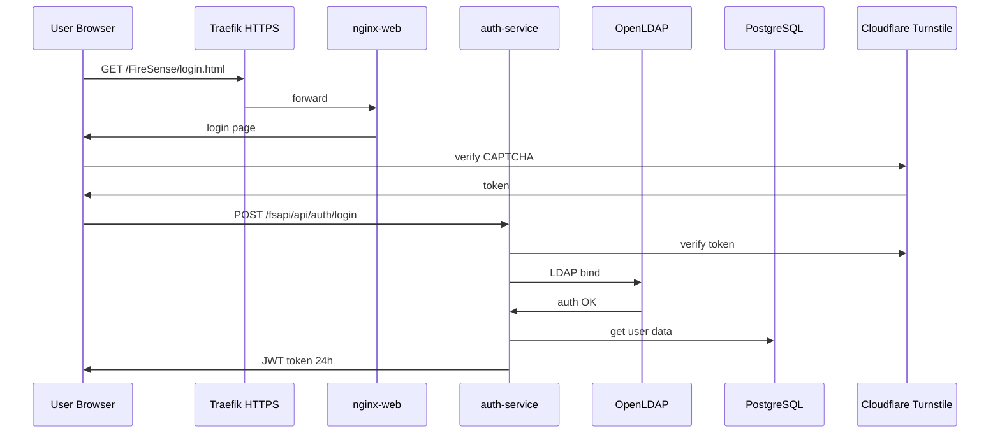
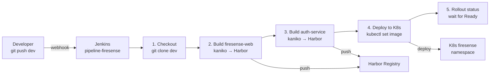
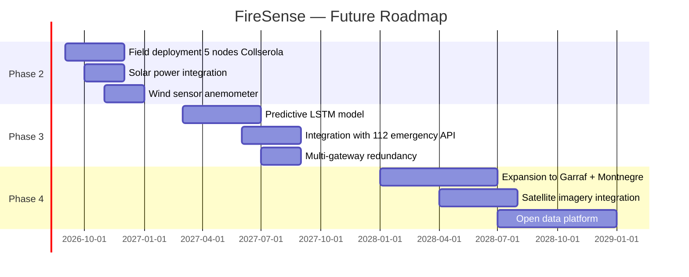

# FireSense — Project Memory
## IoT Forest Fire Early Detection System — Full Technical Report

**Academic Year:** 2025–2026  
**Programme:** CFGS Administració de Sistemes Informàtics en Xarxa (ASIX)  
**Institution:** Institut Tecnològic de Barcelona (ITB)  
**Module:** M0373 · M0369 · M0378 · M0364 · M0370  
**Group:** 2526-PF-ASIXc2-G01  
**Presentation date:** 18 May 2026  

| Role | Member | Responsibilities |
|------|--------|-----------------|
| Backend / Web Developer | Hamza Tayibi | Auth service, web portal, backups, HPA, AI bot, REST API, tests |
| Backend / IoT Developer | Adriano Calderón | IoT pipeline, ChirpStack, Node-RED, CI/CD, Harbor, InfluxDB |
| Scrum Master / Network | Francisco Diaz | K8s networking, Traefik, Prometheus, documentation |

---

## Executive Summary

FireSense is a production-grade, cloud-native IoT platform for real-time forest fire risk detection and early warning. Developed as a final-year project at the Institut Tecnològic de Barcelona, it demonstrates the full integration of modern infrastructure technologies — from low-power LoRaWAN sensor hardware to Kubernetes orchestration, AI-powered anomaly detection, and a professional-grade web platform.

The system continuously monitors soil moisture and air temperature across the Collserola Natural Park using battery-powered RAK4631 WisBlock sensor nodes. Data flows through a fully automated pipeline: LoRa radio → gateway → ChirpStack → MQTT → Node-RED → InfluxDB → Grafana / REST API / AI Telegram Bot. An Isolation Forest machine learning model runs every hour as a Kubernetes CronJob.

**Key achievements:**
- Full Kubernetes cluster: 1 master + 2 workers, all namespaces operational
- End-to-end IoT pipeline validated with RAK4631 hardware
- AI anomaly detection: Isolation Forest (scikit-learn), hourly CronJob
- CI/CD: Jenkins + kaniko + Harbor, full automation from git push to production
- Security: Sealed Secrets, Trivy (0 critical vulnerabilities), kube-bench CIS audit
- Observability: Prometheus + Grafana (3 dashboards: IoT, AI, K8s infrastructure)
- Integration tests: 10/10 passed, TLS secured with Let's Encrypt
- Backup: Daily InfluxDB backup to Longhorn PVC + SCP to external storage
- AI Telegram Bot: real-time forest risk analysis powered by Ollama gpt-oss-20b

---

## 1. Problem Statement & Motivation

### 1.1 Context

Forest fires represent one of the most severe environmental and social threats in the Mediterranean region. Climate change is intensifying drought periods, creating increasingly favourable conditions for large-scale fires. Catalonia alone has lost tens of thousands of hectares in recent decades.

The Collserola Natural Park, located between Barcelona and its inland municipalities, is particularly sensitive. It serves as the primary green lung of the Barcelona metropolitan area, providing ecosystem services to over 3 million people.

### 1.2 Limitations of Existing Solutions

| Detection Method | Coverage | Response Time | Cost | Limitations |
|-----------------|----------|---------------|------|-------------|
| Human patrols | Very limited | Hours | High | Cannot cover entire park continuously |
| Fixed cameras | Narrow FOV | Minutes | Medium | Weather-dependent, blind spots |
| Aerial surveillance | Wide | Hours | Very high | Not continuous, weather-dependent |
| Satellite imagery | Very wide | Hours–days | Medium | Temporal resolution too low |
| Commercial IoT (Dryad Silvanet) | Wide | Minutes | Very high | Proprietary, €5,000–50,000/year |

### 1.3 FireSense Approach

FireSense detects the **conditions that lead to fire** — critically low soil moisture combined with rising temperatures — enabling pre-fire intervention before ignition occurs.

Three core principles:
1. **Open source** — No licensing costs, full control over the stack
2. **On-premises** — No cloud dependency, full data sovereignty
3. **Low cost** — ~€80/node, ~€400/gateway

---

## 2. System Architecture

### 2.1 Infrastructure Overview



**Kubernetes namespaces:**

| Namespace | Services |
|-----------|---------|
| `iot` | ChirpStack, Node-RED, Mosquitto, InfluxDB, Grafana, Redis, PostgreSQL-chirpstack, Isolation Forest CronJob, Backup CronJob |
| `firesense` | nginx-web, auth-service, OpenLDAP, PostgreSQL-web, api-rest, ai-bot, Samba |
| `jenkins` | Jenkins CI/CD |
| `harbor` | Harbor Registry + Trivy |
| `monitoring` | Prometheus, node-exporter x3, kube-state-metrics |
| `traefik` | Traefik IngressController |
| `cert-manager` | Let's Encrypt TLS automation |
| `longhorn-system` | Longhorn distributed storage |
| `kube-system` | Sealed Secrets controller |

### 2.2 IoT Data Pipeline



### 2.3 Authentication Flow



### 2.4 CI/CD Pipeline



---

## 3. Hardware Components

### 3.1 Sensor Nodes — RAK4631 WisBlock Core

| Parameter | Value |
|-----------|-------|
| MCU | Nordic nRF52840 (ARM Cortex-M4F @ 64 MHz) |
| LoRa chip | Semtech SX1262 |
| Frequency | EU868 (863–870 MHz) |
| Max TX power | +22 dBm |
| Receive sensitivity | -148 dBm |
| Sleep current | 2.5 µA |
| Operating voltage | 3.3V / 5V via USB |

**Attached sensors:**

| Module | Sensor chip | Measurement | Accuracy |
|--------|------------|-------------|----------|
| RAK1901 | SHTC3 (Sensirion) | Air temperature | ±0.2°C |
| RAK1901 | SHTC3 (Sensirion) | Relative humidity | ±2% RH |
| RAK12023 + RAK12035 | ATtiny441 (Microchip) | Soil moisture | ±3% VWC |

**Power budget:**

| State | Current | Duration | Charge/cycle |
|-------|---------|----------|-------------|
| Deep sleep | 2.5 µA | ~3,598 s | 2.5 µAh |
| Wake + measure | 5 mA | 1 s | 1.4 µAh |
| LoRa TX (SF7) | 87 mA | ~0.1 s | 2.4 µAh |
| **Total per hour** | | | **~6.3 µAh** |

With a 1,000 mAh LiPo battery: **~6 months autonomy** at 1 transmission/hour.

### 3.2 Gateway — RAK7289V2 WisGate Edge Pro

| Parameter | Value |
|-----------|-------|
| Channels | 8 (half-duplex) |
| Frequency | EU868 |
| Sensitivity | -140 dBm |
| Max TX power | 27 dBm |
| Backhaul | Ethernet + WiFi |
| Enclosure | IP67 (outdoor) |
| Antenna gain | 2.5 dBi omnidirectional |
| Estimated range | 5–10 km open terrain · 1–3 km forest |

---

## 4. Software Stack

### 4.1 IoT & Data Layer

**ChirpStack v4** — LoRaWAN Network Server:
- OTAA join procedure (device authentication)
- Adaptive Data Rate (ADR) management
- Packet deduplication
- JavaScript payload codec (binary → JSON)
- MQTT integration

**Node-RED** processing flow:
1. Subscribe to `application/+/device/+/event/up`
2. Parse JSON payload
3. Extract: temperature, soil_moisture, humidity, battery_mv
4. Add tags: dev_eui, application_id
5. Write to InfluxDB

**InfluxDB 2.7:**
- Bucket `sensors`: raw data, 90-day retention
- Bucket `sensors-downsampled`: hourly means, 1-year retention
- InfluxDB Task: automatic downsampling every hour

### 4.2 Application Layer

| Service | Technology | Namespace | Purpose |
|---------|-----------|-----------|---------|
| nginx-web | Nginx + HTML/CSS/JS | firesense | Public web portal |
| auth-service | Flask + JWT + LDAP | firesense | Authentication API |
| OpenLDAP | OpenLDAP | firesense | User directory |
| PostgreSQL-web | PostgreSQL 15 | firesense | User/node database |
| api-rest | Flask + gunicorn | firesense | REST API for sensor data |
| ai-bot | Python + python-telegram-bot | firesense | AI Telegram bot |
| Samba | Samba + LDAP | firesense | File sharing |
| ChirpStack | ChirpStack v4 | iot | LoRaWAN network server |
| Node-RED | Node-RED | iot | Flow automation |
| Mosquitto | Eclipse Mosquitto | iot | MQTT broker |
| InfluxDB | InfluxDB 2.7 | iot | Time-series database |
| Grafana | Grafana 10 | iot | Dashboards |
| Isolation Forest | Python + scikit-learn | iot | AI anomaly detection |
| Backup CronJob | Alpine + influx CLI | iot | Daily backup |

### 4.3 AI & Machine Learning — Isolation Forest

The Isolation Forest algorithm (scikit-learn 1.4) runs as a Kubernetes CronJob every hour:
- **Input**: last 24h of temperature + soil moisture readings from InfluxDB
- **Parameters**: 100 estimators, 5% contamination rate, random_state=42
- **Output**: anomaly score + binary flag per data point → InfluxDB `anomalies` measurement
- **Feeds**: Grafana dashboard, REST API, Rangers Portal

Why Isolation Forest for this use case:
- Does not require labelled training data (no historical fire data needed)
- Computationally efficient for time-series
- Handles multi-dimensional anomalies (high temp + low moisture simultaneously)
- Provides continuous anomaly score, not just binary classification

### 4.4 Security Stack

| Component | Technology | Purpose |
|-----------|-----------|---------|
| Secret encryption | Sealed Secrets (Bitnami) | Encrypt K8s secrets in git |
| Image scanning | Trivy (Aqua Security) | Detect CVEs in Docker images |
| CIS audit | kube-bench | Validate K8s CIS benchmarks |
| TLS termination | cert-manager + Let's Encrypt | Automatic certificate management |
| Authentication | OpenLDAP + JWT (HS256) | User identity and access control |
| CAPTCHA | Cloudflare Turnstile | Bot protection on registration |
| Email verification | Resend API | Verified email on registration |
| Registry | Harbor + Trivy | Private registry with vulnerability scanning |

**kube-bench** results (CIS Kubernetes Benchmark v1.8):
- 17 checks PASS
- 2 checks FAIL — fixed (kubelet service file permissions chmod 600)
- 40 checks WARN — manual checks, documented

**Trivy scan**: 0 CRITICAL, 0 HIGH vulnerabilities in all production images.

---

## 5. Web Platform

### 5.1 Public Home Page (/FireSense/)

- Full-screen video background showing Collserola forest
- Animated hero text: "Prevenció d'incendis en temps real"
- Technology showcase section
- Multi-language selector (Catalan, Spanish, English)
- Links to GitHub repository and forest rangers portal

### 5.2 Forest Rangers Portal (/FireSense/agents.html)

Dedicated no-login interface for field agents:
- Interactive Leaflet map with Collserola boundaries and real-time sensor node positions, colour-coded by risk level
- Global risk indicator: BAIX (green) / MODERAT (yellow) / ALT (orange) / CRÍTIC (red), updated every 30 seconds
- Real-time metrics: average temperature, soil moisture, active node count, anomaly count last 24h
- Alert panel: recent Isolation Forest anomalies with device ID and timestamp
- Node status: per-node health and latest readings
- Dark futuristic UI (Orbitron + Share Tech Mono fonts, neon accents)

### 5.3 User Dashboard (/FireSense/index.html)

Authenticated dashboard for registered users:
- Personal LoRaWAN node management (add/remove)
- Real-time sensor data per node
- Historical data charts (temperature, soil moisture, battery)
- Device RSSI/SNR indicators

### 5.4 Admin Panel (/FireSense/adminldap.html)

LDAP administration panel:
- Pending user registration queue with approve/reject workflow
- User list with LDAP attributes
- User deletion (removes from LDAP + PostgreSQL)
- Real-time updates without page refresh

---

## 6. Operations & Reliability

### 6.1 Horizontal Pod Autoscaling

| Target | Min replicas | Max replicas | CPU trigger | Memory trigger |
|--------|-------------|-------------|-------------|----------------|
| Grafana Deployment | 1 | 3 | 70% | 80% |
| Node-RED StatefulSet | 1 | 3 | 70% | 80% |

### 6.2 Backup & Disaster Recovery

**Daily backup procedure (02:00 AM):**
1. `influxdb-backup` CronJob runs in `iot` namespace
2. `influx backup` downloads full snapshot to Longhorn PVC
3. Snapshot compressed to `.tar.gz`
4. Master relay script copies via SCP to external client (192.168.244.99)
5. Files older than 7 days deleted from PVC

**DRP targets:**
- RTO (Recovery Time Objective): < 2 hours
- RPO (Recovery Point Objective): < 24 hours
- Full procedures documented in `backend-server/k8s-services-iot/iot/DRP-FireSense.md`

### 6.3 Observability Stack

| Layer | Technology | What it monitors |
|-------|-----------|-----------------|
| Infrastructure | Prometheus + node-exporter | CPU, memory, disk, network per node |
| Kubernetes | kube-state-metrics | Pod status, deployment health, HPA state |
| Application | InfluxDB + Grafana | Sensor readings, anomaly scores, fire risk |

---

## 7. Project Management

### 7.1 Scrum Sprints

**Sprint 1 — Foundation (Weeks 1–3)**

| Task | Responsible | Status |
|------|-------------|--------|
| K8s cluster provisioning (IsardVDI) | Adriano + Francisco | ✅ Done |
| Network configuration + fixed IPs | Francisco | ✅ Done |
| MING stack Dockerfiles | Adriano | ✅ Done |
| K8s manifests (all services) | Francisco | ✅ Done |
| OpenLDAP configuration | Hamza | ✅ Done |
| GitHub repository + documentation | Adriano | ✅ Done |
| Technology comparison | All | ✅ Done |
| Hardware selection + LoRaWAN setup | Adriano + Hamza | ✅ Done |

**Sprint 2 — Security & Infrastructure (Weeks 4–7)**

| Task | Responsible | Status |
|------|-------------|--------|
| Sealed Secrets + Trivy + kube-bench | Adriano | ✅ Done |
| CI/CD Jenkins + kaniko | Adriano | ✅ Done |
| HPA (Grafana + Node-RED) | Hamza | ✅ Done |
| InfluxDB retention policies | Adriano | ✅ Done |
| Backup CronJob + DRP | Hamza | ✅ Done |
| AI Telegram Bot | Hamza | ✅ Done |
| Prometheus + Samba | Francisco | ✅ Done |
| Harbor Trivy scanning | Adriano | ✅ Done |

**Sprint 3 — Features & AI (Weeks 8–10)**

| Task | Responsible | Status |
|------|-------------|--------|
| Forest Rangers Portal (Leaflet) | Hamza + Adriano | ✅ Done |
| REST API + Isolation Forest | Hamza + Francisco | ✅ Done |
| Grafana dashboards | Hamza + Francisco | ✅ Done |
| Technical documentation (English) | Francisco + Hamza | ✅ Done |
| Sustainability plan | Adriano + Francisco | ✅ Done |
| Integration tests + pentest | Hamza | ✅ Done |
| Demo + presentation | All | ✅ Done |

### 7.2 Tools

| Tool | Usage |
|------|-------|
| ProofHub | Sprint planning, task tracking, Gantt chart |
| GitHub | Source code, manifests, documentation |
| Jenkins | CI/CD pipeline, build history |
| Harbor | Docker image registry, vulnerability reports |
| Headlamp | Kubernetes visual dashboard |
| Telegram | Team communication + AI bot testing |

---

## 8. Results & Metrics

### 8.1 Technical KPIs

| KPI | Target | Result |
|-----|--------|--------|
| Integration tests passing | 100% | ✅ 10/10 (100%) |
| Critical vulnerabilities in images | 0 | ✅ 0 (Trivy) |
| kube-bench CIS FAIL checks | 0 | ✅ 2 fixed |
| TLS certificate valid | Yes | ✅ Let's Encrypt exp. Aug 2026 |
| CI/CD build time | < 5 min | ✅ ~3 minutes |
| Backup frequency | Daily | ✅ 02:00 AM daily |
| HPA configured | Yes | ✅ Grafana + Node-RED |
| Namespaces operational | 8 | ✅ 8/8 |
| Services deployed | 20+ | ✅ 24 services |

### 8.2 Cost Analysis

**Hardware cost per deployment unit:**

| Item | Unit cost | Qty | Total |
|------|-----------|-----|-------|
| RAK4631 + RAK19007 | €45 | 3 | €135 |
| RAK1901 sensor | €10 | 3 | €30 |
| RAK12023+RAK12035 | €25 | 3 | €75 |
| LiPo 1000mAh | €8 | 3 | €24 |
| RAK7289V2 gateway | €380 | 1 | €380 |
| **Total hardware** | | | **€644** |

**Software cost:** €0 (100% open source)

**vs. Dryad Silvanet:** €15,000–€50,000/year subscription + hardware  
**vs. Pano AI (camera-based):** €30,000–€100,000/year per camera

---

## 9. Lessons Learned

### 9.1 Technical Challenges

**Challenge 1: Docker socket unavailable in K8s workers**  
Workers use containerd. Solution: replaced Docker-in-Docker with **kaniko** for image builds. kaniko builds from Dockerfiles without requiring a Docker daemon.

**Challenge 2: SCP from pods to external network**  
Pods (172.16.x.x Calico) cannot reach client network (192.168.244.x). Solution: **master relay script** — pod writes backup to PVC, master reads via `kubectl cp` and forwards via SCP.

**Challenge 3: Sealed Secrets controller name**  
Default name expected by `kubeseal` is `sealed-secrets-controller`, but Helm named it `sealed-secrets`. Fixed with `--controller-name=sealed-secrets` flag.

**Challenge 4: Jenkins auth after restart**  
JENKINS_OPTS lost on restart. Solution: `kubectl set env` persists it in StatefulSet spec.

**Challenge 5: Legacy measurement naming**  
Legacy code used `espurna_sensors` measurement from a previous project. Systematically replaced all occurrences with `sensor_data` across Node-RED, web JS, and AI bot.

### 9.2 DevOps Best Practices Applied

- **Infrastructure as Code** — All K8s resources in YAML manifests in git
- **GitOps** — No manual production changes, everything through git + CI/CD
- **Secrets management** — No plaintext secrets in git (Sealed Secrets)
- **Immutable deployments** — Each build creates new image tag, enabling rollbacks
- **Observability first** — Prometheus + Grafana from Sprint 2, not afterthought

### 9.3 Team Reflections

**Hamza Tayibi:**  
*"Integrating the Isolation Forest AI with the Kubernetes CronJob and seeing it detect anomalies automatically was the most rewarding part. The REST API and Rangers Portal give the system real-world utility beyond the academic context."*

**Adriano Calderón:**  
*"Building the complete IoT pipeline from hardware to dashboard taught me how many moving parts are involved in production IoT. The CI/CD pipeline with kaniko was particularly challenging but satisfying."*

**Francisco Diaz:**  
*"Managing Kubernetes networking with Traefik, Calico, and MetalLB gave me a deep understanding of cloud-native infrastructure. The Prometheus + Grafana observability stack is something I will use in every future project."*

---

## 10. Conclusions & Future Work

### 10.1 Conclusions

FireSense demonstrates that a production-grade IoT monitoring system for environmental applications can be built with open-source technologies at a fraction of commercial alternatives. The project successfully integrates hardware, networking, data engineering, AI, security, and DevOps into a coherent, deployable system.

The platform is ready for a pilot field deployment in Collserola Natural Park.

### 10.2 Future Roadmap



---

## 11. References

- LoRa Alliance. (2020). *LoRaWAN Specification v1.0.4*.
- RAK Wireless. (2024). *RAK4631 WisBlock Core Datasheet*. https://docs.rakwireless.com
- RAK Wireless. (2024). *RAK7289V2 WisGate Edge Pro Datasheet*. https://docs.rakwireless.com
- ChirpStack. (2024). *ChirpStack v4 Documentation*. https://www.chirpstack.io/docs/
- InfluxData. (2024). *InfluxDB 2.x Documentation*. https://docs.influxdata.com/
- scikit-learn. (2024). *IsolationForest API Reference*. https://scikit-learn.org/
- Kubernetes. (2024). *Kubernetes Documentation v1.29*. https://kubernetes.io/docs/
- Traefik. (2024). *Traefik Proxy Documentation*. https://doc.traefik.io/traefik/
- Aqua Security. (2024). *Trivy Documentation*. https://trivy.dev/
- Bitnami. (2024). *Sealed Secrets*. https://sealed-secrets.netlify.app/
- Departament d'Acció Climàtica. (2024). *Estadístiques d'incendis forestals a Catalunya*. Generalitat de Catalunya.

---

## Appendix A — Service URLs

| Service | URL |
|---------|-----|
| Web portal | `/FireSense/` |
| Login | `/FireSense/login.html` |
| Dashboard | `/FireSense/index.html` |
| Rangers portal | `/FireSense/agents.html` |
| Admin panel | `/FireSense/adminldap.html` |
| REST API | `/fsapi/v2/api/` |
| ChirpStack | `/chirpstack` |
| Grafana | `/grafana` |
| Node-RED | `/nodered/` |
| Harbor | `/harbor` |
| Jenkins | `/jenkins` |
| Headlamp | `/headlamp` |
| Prometheus | `/prometheus` |

## Appendix B — Repository Structure

```
FireSense/
├── README.md
├── Jenkinsfile
├── backend-server/
│   ├── k8s-web-services/
│   │   ├── src-web/          HTML/CSS/JS web portal
│   │   ├── auth-service/     Flask auth API + Dockerfile
│   │   ├── api-rest/         Flask REST API + Dockerfile
│   │   ├── ai-bot/           Telegram AI bot + Dockerfile
│   │   └── isolation-forest/ Anomaly detection + Dockerfile
│   ├── grafana/              Grafana provisioning
│   ├── influxdb/             InfluxDB configuration
│   └── node-red/             Node-RED flows
├── k8s/
│   ├── iot/                  IoT namespace manifests
│   ├── firesense/            App namespace manifests
│   ├── jenkins/              Jenkins manifests
│   ├── monitoring/           Prometheus manifests
│   ├── grafana-dashboards/   Exported Grafana JSON
│   └── tests/                Integration tests + security reports
└── docs/
    ├── 01-architecture/      Technical documentation
    ├── 02-sprints/           Sprint planning and reviews
    ├── 03-tech-comparison/   Technology comparison
    ├── 04-occupational-risks/
    ├── 06-manuals/
    └── 07-market-analysis/
```

---

*FireSense — Institut Tecnològic de Barcelona · ASIX2c · 2025–2026*  
*Authors: Hamza Tayibi · Adriano Calderón · Francisco Diaz*  
*Repository: https://github.com/AdrianoCalderon-ITB2425/FireSense*  
*Presentation: 18 May 2026*
