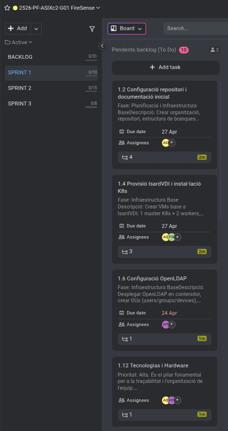

# ACTA — Sprint 1 Planning
## Informació de la Reunió
| Camp | Valor |
|------|-------|
| Data | 14/04/2026 |
| Hora | 15:30 - 16:30 |
| Lloc | Aula ASIX — ITB |
| Sprint | Sprint 1 |
| Durada Sprint | 14/04/2026 - 27/04/2026 |
| Versió | 1.0 |

## Assistents
| Nom | Rol | Assistència |
|-----|-----|-------------|
| Hamza Tayibi | Backend Developer / Web Frontend FireSense | Present |
| Adriano Calderon | Backend Developer | Present |
| Francisco | Scrum Master / Coordinació | Present |

---

## 1. Objectiu del Sprint 1
Construir la infraestructura base del projecte FireSense i el MVP de la plataforma IoT de prevenció d'incendis forestals:
- Stack IoT complet: RAK4631 → ChirpStack v4 → Node-RED → InfluxDB v2 → Dashboard web
- Infraestructura Docker amb nginx proxy a IsardVDI
- Dashboard web FireSense: mapa interactiu Leaflet/CesiumJS + dades en temps real
- Dashboard web Espurna: mapa independent amb nodes IoT propis
- Sistema d'autenticació LDAP + PostgreSQL + JWT
- Seguretat: API keys ocultes via proxy nginx (InfluxDB + ChirpStack)
- Manual de configuració client (DOCX, 13 seccions)

---

## 2. Arquitectura Implementada
| Component | Tecnologia | Estat |
|-----------|-----------|-------|
| Node IoT sensor | RAK4631 (nRF52840 + SX1262) + RAK1901 + RAK12035 | Operatiu |
| Gateway LoRaWAN | RAK7289V2 — EU868 OTAA | Operatiu |
| Network Server | ChirpStack v4 (Docker) | Operatiu |
| Message Broker | Mosquitto MQTT v2 | Operatiu |
| Processament dades | Node-RED (flow importable) | Operatiu |
| Base de dades time-series | InfluxDB v2 — bucket sensor_data | Operatiu |
| Base de dades relacional | PostgreSQL — users + nodes | Operatiu |
| Directori d'usuaris | OpenLDAP — dc=firesense,dc=io | Operatiu |
| Autenticació | Auth-service Flask + JWT + ldap3 | Operatiu |
| Web proxy / servidor | Nginx (Docker) — HTTPS + proxy segur | Operatiu |
| Dashboard FireSense | HTML/CSS/JS + Leaflet + CesiumJS | Operatiu |
| Dashboard Espurna | HTML/CSS/JS + Leaflet (nginx independent) | Operatiu |
| Visualització | Grafana (Docker) — panels InfluxDB | Operatiu |

---

## 3. Backlog del Sprint — Tasques Completades
| ID | Tasca | Assignat | Est. | Estat |
|----|-------|----------|------|-------|
| 1.1 | Kick-off i repartiment de rols | Tots | 2h | Fet |
| 1.2 | Configuració repositori GitHub (branques dev/main, .gitignore, secrets) | Adriano | 3h | Fet |
| 1.3 | Planificació Gantt a ProofHub (sprints, milestones) | Adriano | 4h | Fet |
| 1.4 | Provisió IsardVDI i instal·lació Docker | Adriano, Francisco | 4h | Fet |
| 1.6 | Configuració OpenLDAP + phpLDAPadmin  | Hamza | 5h | Fet |
| 1.8 | Docker Compose stack MING (Mosquitto+InfluxDB+Node-RED+Grafana) | Adriano | 6h | Fet |
| 1.9 | ChirpStack v4 Docker + chirpstack.toml + eu868.toml | Hamza | 5h | Fet |
| 1.10 | Manifests Kubernetes per a Mosquitto i InfluxDB | Francisco | 6h | Fet |
| 1.11 | Manifests Kubernetes per a Node-RED i Grafana | Francisco | 4h | Fet |
| 1.12 | Tecnologias i Hardware | Adriano, Hamza | 16h | Fet |

**Total estimat: ~96h**

---

## 4. Definició de Done (DoD)
Una tasca es considera completada quan:
- El codi/configuració funciona correctament al servidor IsardVDI
- Documentat al repositori GitHub (branca dev → merge main)
- Les APIs no exposen claus sensibles al navegador (F12 net)
- El dashboard web carrega sense errors de consola
- Commit pujat a GitHub amb missatge descriptiu

---

## 5. Riscos Identificats i Resolts
| Risc | Probabilitat | Impacte | Acció aplicada |
|------|-------------|---------|----------------|
| Secrets exposats al GitHub (Mapbox, ChirpStack, InfluxDB) | Alta | Crític | Resolt: git filter-branch + proxy nginx |
| Límit MapTiler 100k requests superat | Alta | Alt | Resolt: nou token creat 27/04/2026 |
| Templates Espurna inexistents al contenidor nginx | Mitjana | Alt | Resolt: `\|\| true` a entrypoint.sh |
| NODES hardcodejats al config.js visible al F12 | Alta | Mitjà | Resolt: nodes carregats des de /api/nodes |
| Gateway Offline (RAK7289V2 apagat) | Baixa | Baix | Pendent: gateway físic al laboratori |
| Join OTAA falla si AppKey no coincideix | Mitjana | Alt | Documentat al manual client (pas 4.2) |

---

## 6. Captures ProofHub — Tasques Sprint 1

---

## 7. Propera Reunió
| Tipus | Data | Hora | Objectiu |
|-------|------|------|----------|
| Sprint Review 1 | 27/04/2026 | 16:00 | Presentar MVP FireSense al professor |
| Sprint 2 Planning | 28/04/2026 | 15:30 | Definir tasques fase 2 |
| Daily Standup | Diari | 15:00 | Seguiment tasques en curs |

---

## 8. Equip
| Rol | Nom |
|-----|-----|
| Scrum Master | Francisco |
| Backend Developer / Web Frontend FireSense | Hamza Tayibi |
| Backend Developer | Adriano Calderon |

---
*Acta generada: 27/04/2026 — Versió 1.0*
*FireSense IoT Platform — Institut Tecnològic de Barcelona — ASIX2c — 2025/2026*
