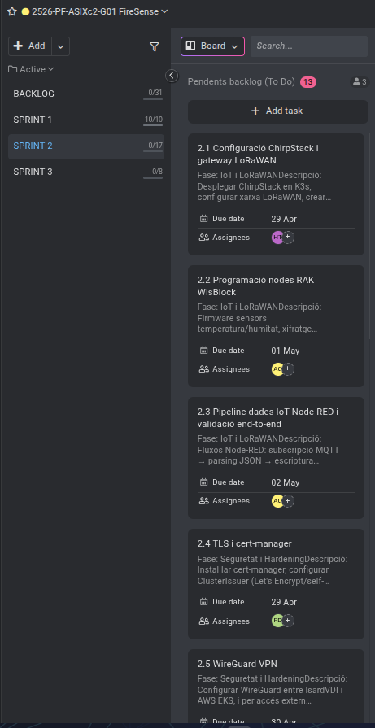

# Acta — Sprint 2 Planning
## Meeting Information
| Field | Value |
|-------|-------|
| Date | 28/04/2026 |
| Time | 15:30 - 16:30 |
| Location | ASIX Classroom — ITB |
| Sprint | Sprint 2 |
| Sprint Duration | 28/04/2026 - 04/05/2026 |
| Version | 1.0 |

## Attendees
| Name | Role | Attendance |
|------|------|------------|
| Hamza Tayibi | Backend Developer / Web Frontend FireSense | Present |
| Adriano Calderon | Backend Developer | Present |
| Francisco | Scrum Master / Coordination | Present |

---

## 1. Sprint 2 Objective
Extend the FireSense platform with advanced infrastructure components: Kubernetes deployment on K3s, IoT data pipeline validation, security hardening with TLS and WireGuard VPN, hybrid cloud setup with AWS EKS, CI/CD pipelines, database management with backups, and additional services including Telegram alerts and monitoring.

---

## 2. Architecture Extensions — Sprint 2
| Component | Technology | Status |
|-----------|-----------|--------|
| Container orchestration | K3s (local) + AWS EKS (cloud) | Planned |
| TLS certificates | cert-manager + Let's Encrypt / self-signed | Planned |
| VPN tunnel | WireGuard — IsardVDI ↔ AWS EKS | Planned |
| Secret management | Sealed Secrets + Trivy/kube-bench audit | Planned |
| Container registry | Harbor Registry (Helm) | Planned |
| CI/CD pipeline | Jenkins + GitHub Actions + Helm Charts | Planned |
| Ingress + autoscaling | Nginx Ingress Controller + HPA | Planned |
| Document database | MongoDB StatefulSet | Planned |
| Backup strategy | CronJobs InfluxDB + MongoDB + DRP plan | Planned |
| Alerting | Postfix email + Telegram bot via Node-RED | Planned |
| Monitoring | Prometheus + node-exporter + kube-state-metrics | Planned |
| File sharing | Samba server | Planned |
| DNS + network | CoreDNS + ISC DHCP + VLANs IoT segment | Planned |

---

## 3. Sprint Backlog — Assigned Tasks
| ID | Task | Assigned | Due | Priority |
|----|------|----------|-----|----------|
| 2.1 | ChirpStack configuration and LoRaWAN gateway — Deploy ChirpStack on K3s, configure LoRaWAN network, create applications and device profiles | Hamza | 29 Apr | High |
| 2.2 | RAK WisBlock node programming — Firmware for temperature/humidity sensors, LoRaWAN data encryption | Adriano | 01 May | High |
| 2.3 | IoT data pipeline Node-RED and end-to-end validation — Node-RED flows: MQTT subscription → JSON parsing → database write | Adriano | 02 May | High |
| 2.4 | TLS and cert-manager — Install cert-manager, configure ClusterIssuer (Let's Encrypt/self-signed) | Francisco | 29 Apr | High |
| 2.5 | WireGuard VPN — Configure WireGuard between IsardVDI and AWS EKS, and for external access | Hamza | 30 Apr | High |
| 2.6 | Encrypted secrets and Trivy/kube-bench audit — Configure Sealed Secrets, remove plaintext secrets, image scanning and security audits | Hamza | 04 May | High |
| 2.7 | AWS EKS provisioning and K3s → EKS replication — Create EKS cluster on AWS, nodegroups, adapt manifests for EKS | Adriano | 05 May | Medium |
| 2.8 | CI/CD pipeline Jenkins Actions and Helm Charts — Create workflows: Docker build → Trivy scan → Harbor push → Helm deploy | Adriano | 06 May | Medium |
| 2.9 | Nginx Ingress Controller and HPA — Deploy Nginx Ingress, configure rules for Grafana (TLS) and Horizontal Pod Autoscaler | Hamza | 07 May | Medium |
| 2.10 | MongoDB StatefulSet and InfluxDB retention policies — Deploy MongoDB as StatefulSet and configure retention policies in InfluxDB | Adriano | 07 May | Medium |
| 2.11 | Backup CronJobs and DRP — Configure CronJobs for InfluxDB and MongoDB backup, disaster recovery plan | Hamza | 08 May | Medium |
| 2.12 | Postfix email alerts and Telegram bot — Deploy Postfix, integrate with Grafana Alerting and Node-RED for notifications | Adriano | 06 May | Medium |
| 2.13 | Prometheus monitoring and Samba — Deploy Prometheus + node-exporter + kube-state-metrics and Samba server | Francisco | 09 May | Medium |
| 2.14 | Harbor Registry deployment — Install Harbor with Helm, configure HTTPS, create private projects and enable scanning | Francisco | 07 May | Medium |
| 2.15 | Network and DNS configuration — CoreDNS internal, ISC DHCP for IoT segment, VLAN configuration | Adriano | 07 May | Medium |
| 2.16 | Market research — Research whether this solution already exists in the market | Adriano | 06 May | Low |
| 2.17 | Occupational risk analysis — Analyse the occupational risks of the project | Adriano | 06 May | Low |

**Total tasks: 17**

---

## 4. Definition of Done (DoD)
A task is considered complete when:
- The code/configuration works correctly on the IsardVDI or AWS EKS cluster
- Kubernetes manifests or Helm charts committed to GitHub (dev branch)
- Security: no plaintext secrets in repository (Sealed Secrets or env vars)
- Services accessible via Ingress with valid TLS certificate
- Commit pushed to GitHub with a descriptive message

---

## 5. Identified Risks
| Risk | Probability | Impact | Action |
|------|-------------|--------|--------|
| AWS EKS costs exceed free tier | Medium | High | Monitor AWS billing daily, use t3.micro instances |
| WireGuard tunnel instability between IsardVDI and EKS | Medium | High | Test connectivity before deploying dependent services |
| cert-manager fails with self-signed on IsardVDI | Low | Medium | Fall back to manual TLS certificates if needed |
| Harbor disk space exhaustion | Low | Medium | Configure image retention policies from day one |
| Telegram bot token exposed in repository | Medium | Critical | Use Sealed Secrets or Kubernetes secrets, never hardcode |
| K3s and EKS manifest incompatibilities | Medium | Medium | Test manifests on K3s first before adapting to EKS |

---

## 6. ProofHub Captures — Sprint 2 Tasks

---

## 7. Next Meeting
| Type | Date | Time | Objective |
|------|------|------|-----------|
| Daily Standup | Daily | 15:00 | Task progress follow-up |
| Sprint Review 2 | 04/05/2026 | 16:00 | Present Sprint 2 deliverables |
| Sprint 3 Planning | 05/05/2026 | 15:30 | Define phase 3 tasks |

---

## 8. Team
| Role | Name |
|------|------|
| Scrum Master | Francisco |
| Backend Developer / Web Frontend FireSense | Hamza Tayibi |
| Backend Developer | Adriano Calderon |

---
*Minutes generated: 28/04/2026 — Version 1.0*
*FireSense IoT Platform — Institut Tecnologic de Barcelona — ASIX2c — 2025/2026*
