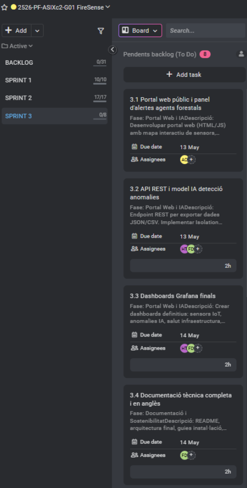

# Acta — Sprint 3 Planning

## Meeting Information
| Field | Value |
|-------|-------|
| Date | 11/05/2026 |
| Time | 15:30 - 16:30 |
| Location | ASIX Classroom — ITB |
| Sprint | Sprint 3 |
| Sprint Duration | 11/05/2026 - 18/05/2026 |
| Version | 1.0 |

## Attendees
| Name | Role | Attendance |
|------|------|------------|
| Hamza Tayibi | Backend Developer / Web Frontend FireSense | Present |
| Adriano Calderon | Backend Developer | Present |
| Francisco Diaz | Scrum Master / Coordination | Present |

---

## 1. Sprint 3 Objective
Deliver the AI features, REST API, forest rangers web portal, complete all technical documentation in English, run integration tests and security audit, and present the final project to the tribunal:
- Forest Rangers Portal with Leaflet interactive map
- REST API with 5 endpoints for sensor data and risk assessment
- Isolation Forest AI anomaly detection as Kubernetes CronJob
- 3 Grafana dashboards: IoT, AI anomalies, K8s infrastructure
- Complete technical documentation in English
- Sustainability and digital transformation plan
- Professional project memory (11 sections)
- Integration tests 10/10 + nmap + nikto security audit
- Final tribunal presentation

---

## 2. Implemented Architecture
| Component | Technology | Status |
|-----------|-----------|--------|
| Rangers Portal | HTML/CSS/JS + Leaflet.js | Planned |
| REST API | Flask + gunicorn (firesense namespace) | Planned |
| Anomaly detection | scikit-learn Isolation Forest CronJob | Planned |
| Grafana dashboards | InfluxDB + Prometheus datasources | Planned |
| Documentation | Markdown (English) + Mermaid diagrams | Planned |
| Integration tests | Bash script + nmap + nikto | Planned |
| Presentation | Live demo + slides | Planned |

---

## 3. Sprint Backlog — Assigned Tasks
| ID | Task | Assigned | Est. | Priority |
|----|------|----------|------|----------|
| 3.1 | Forest Rangers Portal (HTML/JS Leaflet) | Hamza + Adriano | 12h | High |
| 3.2 | REST API + Isolation Forest IA (scikit-learn CronJob) | Hamza + Francisco | 16h | High |
| 3.3 | Grafana dashboards finals (IoT + IA + infra) | Hamza + Francisco | 10h | High |
| 3.4 | Technical documentation complete in English | Francisco + Hamza | 14h | High |
| 3.5 | Sustainability plan | Adriano + Francisco | 8h | Medium |
| 3.6 | Project memory | Adriano | 12h | High |
| 3.7 | Integration tests + internal pentest | Hamza | 10h | High |
| 3.8 | Demo + tribunal presentation (18/05/2026) | All | 16h | Critical |

**Total estimated: ~98h**

---

## 4. Definition of Done (DoD)
A task is considered complete when:
- Code pushed to dev branch
- Docker image built and pushed to Harbor (if applicable)
- K8s deployment verified (kubectl get pods — all Running)
- Feature tested end-to-end
- Documentation updated in English
- Integration tests passing (10/10)

---

## 5. Identified Risks
| Risk | Probability | Impact | Action |
|------|-------------|--------|--------|
| No real sensor data in InfluxDB | High | Medium | API handles empty data gracefully |
| Jenkins rebuild breaks nginx image | Medium | High | Keep v13 as fallback |
| Time pressure for documentation | Medium | Medium | Divide docs by member, use templates |
| Presentation preparation insufficient | Low | High | Rehearse demo flow 2 days before |
| Mermaid diagrams not rendering in GitHub | Low | Low | Use Python to write files, avoid heredoc |

---

## 6. ProofHub Captures — Sprint Planning

---

## 7. Next Meeting
| Type | Date | Time | Objective |
|------|------|------|-----------|
| Sprint Review 3 | 18/05/2026 | 16:00 | Present final deliverables |
| Final presentation | 18/05/2026 | 10:00 | Tribunal presentation |

---

## 8. Team
| Role | Name |
|------|------|
| Scrum Master | Francisco Diaz |
| Backend Developer / Web Frontend FireSense | Hamza Tayibi |
| Backend Developer | Adriano Calderon |

---
*Acta generated: 11/05/2026 — Version 1.0*
*FireSense IoT Platform — Institut Tecnologic de Barcelona — ASIX2c — 2025/2026*
