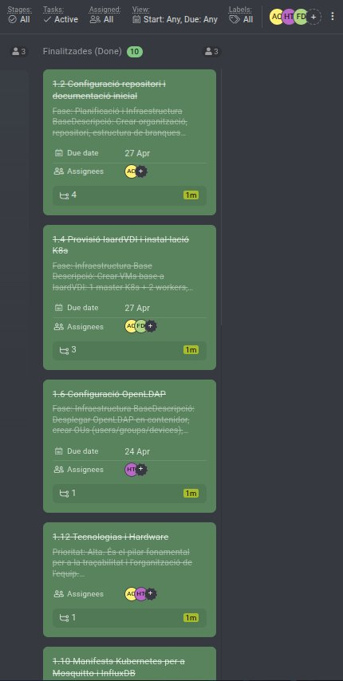

## 1. Sprint 1 Objective — Review
The objective of Sprint 1 was to build the base infrastructure of the FireSense project and the MVP of the IoT forest fire prevention platform. Objective achieved at 100%.

---

## 2. Demo — What was delivered?
### Completed Tasks (10/10)
| ID | Task | Assigned | Result |
|----|------|----------|--------|
| 1.1 | Kick-off and role assignment | All | Roles defined and team organized |
| 1.2 | GitHub repository setup | Adriano | dev/main branches, .gitignore, secrets removed |
| 1.3 | Gantt planning on ProofHub | Adriano | 3 sprints planned with milestones |
| 1.4 | IsardVDI provisioning and Docker installation | Adriano, Francisco | VM operational with Docker and network configured |
| 1.6 | OpenLDAP + phpLDAPadmin configuration | Hamza | dc=firesense,dc=io, users/groups OUs created |
| 1.8 | Docker Compose MING stack | Adriano | Mosquitto + InfluxDB + Node-RED + Grafana operational |
| 1.9 | ChirpStack v4 Docker | Hamza | chirpstack.toml + eu868.toml configured and working |
| 1.10 | Kubernetes manifests Mosquitto + InfluxDB | Francisco | Deployments, Services and PVCs created |
| 1.11 | Kubernetes manifests Node-RED + Grafana | Francisco | Deployments and ConfigMaps functional |
| 1.12 | Technologies and Hardware | Adriano, Hamza | RAK4631 programmed, gateway configured, data in InfluxDB |

---

## 3. Live Demonstration
During the review, a live demonstration was carried out of:
- FireSense dashboard accessible via HTTPS with functional LDAP login
- 4-step onboarding wizard for adding IoT nodes (DevEUI + lat/lng)
- Interactive Leaflet map with dynamic nodes loaded from PostgreSQL
- Secure nginx proxy — F12 verification that INFLUX_TOKEN and CHIRPSTACK_KEY are not visible
- ChirpStack with EU868 Device Profile + 7-byte JavaScript codec
- Importable Node-RED flow with RAK4631 payload decoding
- Downloadable client manual DOCX from the wizard (13 sections)

---

## 4. Sprint Metrics
| Metric | Value |
|--------|-------|
| Planned tasks | 10 |
| Completed tasks | 10 |
| Sprint velocity | 100% |
| Estimated hours | ~96h |
| GitHub commits | +40 commits (dev branch) |
| Active Docker services | 11 containers |
| Lines of code (approx.) | ~4,000 |

---

## 5. What went well
- Docker infrastructure fully operational from day one — no container downtime in production
- Espurna/FireSense separation in independent nginx instances without interference
- API key security resolved with nginx proxy — INFLUX_TOKEN and CHIRPSTACK_KEY completely hidden from the browser
- Dynamic nodes working correctly — the wizard adds nodes to PostgreSQL and they appear on the map automatically
- Complete and detailed client manual (13 sections, full step-by-step flow)
- Removal of secrets from the GitHub repository with git filter-branch without losing commit history

---

## 6. What went wrong / Impediments
| Impediment | Impact | Resolution |
|-----------|--------|------------|
| MapTiler key invalidated due to exceeding 100k requests | Map not loading | New token created on 27/04/2026 |
| Missing Espurna templates in nginx container causing crash loop | nginx-proxy in restart loop | Added `|| true` to entrypoint.sh |
| Secrets (Mapbox, InfluxDB, ChirpStack) accidentally pushed to GitHub | GitHub push protection blocking pushes | git filter-branch to rewrite history |
| Hardcoded nodes in config.js visible in F12 | Security issue | Nodes loaded dynamically from /api/nodes |
| `sed -i` not working inside nginx container (read-only volume) | 2h debugging block | Substitution done on host before build |

---

## 7. ProofHub Captures — Done Tasks

---

## 8. Retrospective
### Start doing
- Smaller and more descriptive commits to facilitate code review
- Document technical decisions at the moment they are made

### Stop doing
- Hardcoding API keys and secrets in source code
- Making changes directly to `main` without going through `dev`

### Keep doing
- Clear separation of responsibilities per component
- Checking the browser F12 to verify security
- Documenting each feature in the client manual

---

## 9. Team
| Role | Name |
|------|------|
| Scrum Master | Francisco |
| Backend Developer / Web Frontend FireSense | Hamza Tayibi |
| Backend Developer | Adriano Calderon |

---
*Minutes generated: 27/04/2026 — Version 1.0*
*FireSense IoT Platform — Institut Tecnologic de Barcelona — ASIX2c — 2025/2026*
