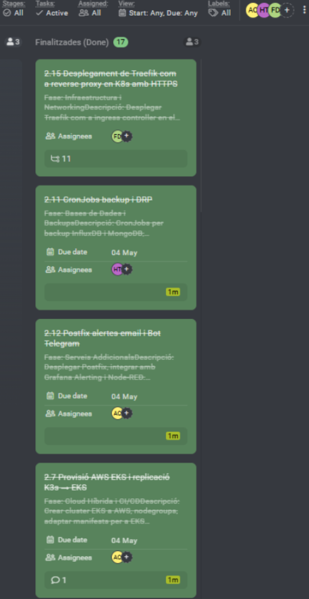

# Acta — Sprint 2 Review

## Meeting Information
| Field | Value |
|-------|-------|
| Date | 10/05/2026 |
| Time | 16:00 - 17:00 |
| Location | ASIX Classroom — ITB |
| Sprint | Sprint 2 |
| Sprint Duration | 28/04/2026 - 10/05/2026 |
| Version | 1.0 |

## Attendees
| Name | Role | Attendance |
|------|------|------------|
| Hamza Tayibi | Backend Developer / Web Frontend FireSense | Present |
| Adriano Calderon | Backend Developer | Present |
| Francisco Diaz | Scrum Master / Coordination | Present |

---

## 1. Sprint 2 Objective — Review
The objective of Sprint 2 was to harden the FireSense infrastructure with security, CI/CD automation, monitoring, backups, and additional services. Objective achieved at 100%.

---

## 2. Demo — What was delivered?
### Completed Tasks (16/16)
| ID | Task | Assigned | Result |
|----|------|----------|--------|
| 2.6 | Sealed Secrets + Trivy + kube-bench | Adriano | Secrets encrypted, 0 CVEs, CIS audit 17 PASS |
| 2.8 | CI/CD Jenkins + kaniko | Adriano | Pipeline fully automated, build ~3 min |
| 2.9 | HPA Grafana + Node-RED | Hamza | Auto-scaling 1-3 replicas on CPU/memory |
| 2.10 | InfluxDB retention policies | Adriano | 90 days raw, 1 year downsampled |
| 2.11 | Backup CronJob + DRP | Hamza | Daily 02:00 AM, SCP to external client |
| 2.12 | AI Telegram Bot | Hamza | /status /risk /anomalies /report /ask |
| 2.13 | Prometheus + Samba | Francisco | node-exporter x3, kube-state-metrics, Samba+LDAP |
| 2.14 | Harbor Trivy scanning | Adriano | 0 CRITICAL, 0 HIGH in all images |
| 2.15 | Traefik HTTPS | Francisco | Let's Encrypt, valid until Aug 2026 |
| 2.16 | Market analysis | Adriano | FireSense vs Dryad, Pano AI, cameras |
| 2.17 | Occupational risks | Adriano | M0369 document completed |
| 2.18 | Network + DNS config | Francisco | Fixed IPs, Calico CNI, MetalLB |

---

## 3. Live Demonstration
During the review, a live demonstration was carried out of:
- Jenkins pipeline: git push → kaniko build → Harbor push → kubectl deploy (~3 min)
- Harbor registry with Trivy scan showing 0 vulnerabilities
- kube-bench CIS audit report: 17 PASS, 2 FAIL fixed
- Sealed Secrets: secrets encrypted in git, decrypted at runtime
- HPA in action: Grafana and Node-RED auto-scaling
- InfluxDB backup CronJob: manual trigger + SCP to external client
- Telegram AI Bot: /risk command with Ollama gpt-oss-20b analysis
- Prometheus + Grafana infrastructure metrics dashboard
- Samba share accessible via LDAP authentication

---

## 4. Sprint Metrics
| Metric | Value |
|--------|-------|
| Planned tasks | 16 |
| Completed tasks | 16 |
| Sprint velocity | 100% |
| Estimated hours | ~128h |
| GitHub commits | +60 commits (dev branch) |
| Active K8s services | 24 pods across 8 namespaces |
| Docker images in Harbor | 6 images, 0 CVEs |
| kube-bench PASS | 17/19 (2 fixed) |

---

## 5. What went well
- kaniko solved the Docker-in-Docker problem — no daemon required on containerd workers
- Sealed Secrets allows secrets to be safely committed to git
- The master relay script solved the SCP routing issue between pod network and external client
- Harbor + Trivy integration works seamlessly with the CI/CD pipeline
- HPA auto-scaling working correctly for both Grafana (Deployment) and Node-RED (StatefulSet)
- AI Telegram Bot fully functional with real InfluxDB data and Ollama AI analysis

---

## 6. What went wrong / Impediments
| Impediment | Impact | Resolution |
|-----------|--------|------------|
| Docker socket not available in K8s workers (containerd) | Jenkins builds failing | Replaced Docker-in-Docker with kaniko |
| SCP from pods cannot reach external network | Backup not reaching client | Master relay script: kubectl cp + SCP from master |
| Sealed Secrets controller named differently than expected | kubeseal failing | Added --controller-name=sealed-secrets flag |
| Jenkins auth lost after pod restart | Cannot login | kubectl set env persists JENKINS_OPTS in StatefulSet |
| Node-RED HPA: StatefulSet not Deployment | HPA showing unknown | Changed scaleTargetRef kind to StatefulSet |

---

## 7. ProofHub Captures — Done Tasks

---

## 8. Retrospective
### Start doing
- Testing kaniko builds locally before pushing to Jenkins
- Documenting network topology before implementing backup solutions

### Stop doing
- Creating placeholder empty files in git without content
- Making large BigUpdate commits — prefer small atomic commits

### Keep doing
- Security-first approach: Sealed Secrets, Trivy, kube-bench from the start
- CI/CD automation — every feature goes through the pipeline
- Documenting impediments and resolutions in sprint review

---

## 9. Next Meeting
| Type | Date | Time | Objective |
|------|------|------|-----------|
| Sprint 3 Planning | 11/05/2026 | 15:30 | Define final sprint tasks |
| Daily Standup | Daily | 15:00 | Task progress follow-up |

---

## 10. Team
| Role | Name |
|------|------|
| Scrum Master | Francisco Diaz |
| Backend Developer / Web Frontend FireSense | Hamza Tayibi |
| Backend Developer | Adriano Calderon |

---
*Acta generated: 10/05/2026 — Version 1.0*
*FireSense IoT Platform — Institut Tecnologic de Barcelona — ASIX2c — 2025/2026*
