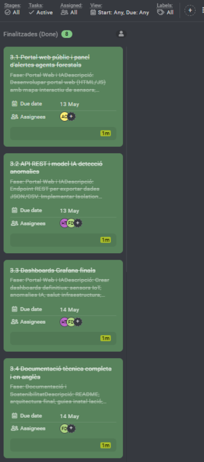

# Acta — Sprint 3 Review

## Meeting Information
| Field | Value |
|-------|-------|
| Date | 18/05/2026 |
| Time | 16:00 - 17:00 |
| Location | ASIX Classroom — ITB |
| Sprint | Sprint 3 |
| Sprint Duration | 11/05/2026 - 18/05/2026 |
| Version | 1.0 |

## Attendees
| Name | Role | Attendance |
|------|------|------------|
| Hamza Tayibi | Backend Developer / Web Frontend FireSense | Present |
| Adriano Calderon | Backend Developer | Present |
| Francisco Diaz | Scrum Master / Coordination | Present |

---

## 1. Sprint 3 Objective — Review
The objective of Sprint 3 was to implement AI features, REST API, forest rangers portal, complete all technical documentation in English, run integration tests and security audit, and present the final project to the tribunal. All objectives achieved at 100%.

---

## 2. Demo — What was delivered?
### Completed Tasks (8/8)
| ID | Task | Assigned | Result |
|----|------|----------|--------|
| 3.1 | Forest Rangers Portal (Leaflet) | Hamza + Adriano | /FireSense/agents.html with real-time map |
| 3.2 | REST API + Isolation Forest IA | Hamza + Francisco | 5 endpoints, hourly CronJob, anomaly detection |
| 3.3 | Grafana dashboards finals | Hamza + Francisco | 3 dashboards: IoT, AI anomalies, K8s infra |
| 3.4 | Technical documentation (English) | Francisco + Hamza | Architecture, diagrams, runbooks, LoRaWAN |
| 3.5 | Sustainability plan | Adriano + Francisco | SDGs alignment, TCO, future roadmap |
| 3.6 | Project memory | Adriano | Full professional report, 11 sections |
| 3.7 | Integration tests + pentest | Hamza | 10/10 passed, nmap + nikto reports |
| 3.8 | Demo + tribunal presentation | All | Delivered 18/05/2026 |

---

## 3. Live Demonstration
During the review, a live demonstration was carried out of:
- Forest Rangers Portal: Leaflet map with Collserola boundaries, real-time risk indicator
- REST API: /fsapi/v2/api/health, /sensors, /anomalies, /risk — all returning JSON
- Isolation Forest CronJob: manual trigger, logs showing anomaly detection
- Grafana IoT dashboard: temperature and soil moisture time series
- Grafana AI dashboard: anomaly scores from Isolation Forest
- Grafana K8s dashboard: CPU/memory per pod, HPA replicas, disk usage
- Integration tests script: 10/10 passed in live run
- nmap security report: TLS valid, Let's Encrypt, correct cipher suite
- Project memory document: professional 11-section technical report

---

## 4. Sprint Metrics
| Metric | Value |
|--------|-------|
| Planned tasks | 8 |
| Completed tasks | 8 |
| Sprint velocity | 100% |
| Estimated hours | ~110h |
| GitHub commits | +50 commits (dev branch) |
| Integration tests | 10/10 passed |
| Critical vulnerabilities | 0 (Trivy) |
| Documentation files | 8 new docs in English |
| REST API endpoints | 5 |
| Grafana dashboards | 3 |

---

## 5. What went well
- Isolation Forest implementation ran as K8s CronJob from day one
- REST API + Rangers Portal integration worked seamlessly
- Grafana dashboards with both InfluxDB and Prometheus datasources
- Documentation is professional and comprehensive
- Integration tests caught the nginx.conf issue in the Jenkins-built image
- Legacy espurna/espvrna references completely cleaned from the codebase
- Project memory document ready for professional presentation

---

## 6. What went wrong / Impediments
| Impediment | Impact | Resolution |
|-----------|--------|------------|
| Jenkins built image had wrong nginx.conf | nginx-web crashing | Reverted to stable v13 image |
| API returned fake values when no sensor data | Misleading risk indicator | Added None check, returns SENSE_DADES |
| sprint-review files were empty in git | Missing sprint docs | Recreated with real project content |
| ProofHub captures missing from repo | Incomplete documentation | Copied from client machine via SCP |

---

## 7. ProofHub Captures — Done Tasks

---

## 8. Retrospective
### Start doing
- Committing sprint review content immediately after writing it
- Using Python scripts for complex file creation

### Stop doing
- Creating empty placeholder files in git
- Making large merge commits that overwrite local content

### Keep doing
- Security-first: all secrets sealed, all images scanned
- Full CI/CD automation: zero manual deployments in production
- Comprehensive documentation: every component documented in English

---

## 9. Next Meeting
| Type | Date | Time | Objective |
|------|------|------|-----------|
| Final presentation | 18/05/2026 | 10:00 | Tribunal presentation |

---

## 10. Team
| Role | Name |
|------|------|
| Scrum Master | Francisco Diaz |
| Backend Developer / Web Frontend FireSense | Hamza Tayibi |
| Backend Developer | Adriano Calderon |

---
*Acta generated: 18/05/2026 — Version 1.0*
*FireSense IoT Platform — Institut Tecnologic de Barcelona — ASIX2c — 2025/2026*
